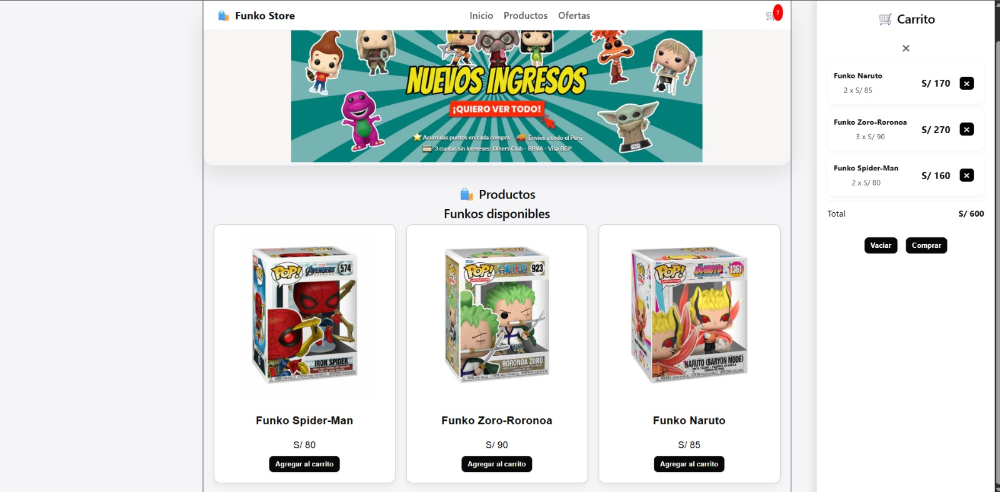

# 🛒 Funko Store — React Ecommerce

Aplicación web tipo ecommerce desarrollada con React que simula una tienda online de productos Funko Pop. El proyecto está enfocado en la gestión de estado, experiencia de usuario y construcción de interfaces modernas.

---

## 🌐 Live Demo

🔗 https://funko-store-react.netlify.app/
 ## 📸 Preview


---

## ⚙️ Tech Stack

* React
* JavaScript
* CSS3
* Vite

---

## ✨ Features

* Gestión de carrito de compras (add/remove)
* Renderizado dinámico de productos
* Cálculo automático del total
* Interfaz responsive
* Actualización en tiempo real

---

## 🧩 Arquitectura

El proyecto está estructurado en componentes reutilizables:

* `Navbar` → navegación principal
* `ProductList` → listado de productos
* `Cart` → lógica y visualización del carrito

---

## 🚀 Getting Started

```bash id="3qpxl2"
git clone https://github.com/RodolfoCoria24/funko-store-react.git
cd funko-store-react
npm install
npm run dev
```

---

## 📦 Build

```bash id="n7m8v1"
npm run build
```

---

## 📈 Roadmap

* Implementación de sistema de autenticación
* Integración de pagos (Stripe / PayPal)
* Filtros y búsqueda avanzada
* Mejora de UI/UX (animaciones y feedback visual)

---

## 👨‍💻 Author

Rodolfo Coria

---

## 📌 Notes

Este proyecto fue desarrollado como parte de práctica en desarrollo frontend, enfocado en mejorar habilidades en React y lógica de aplicaciones web.
